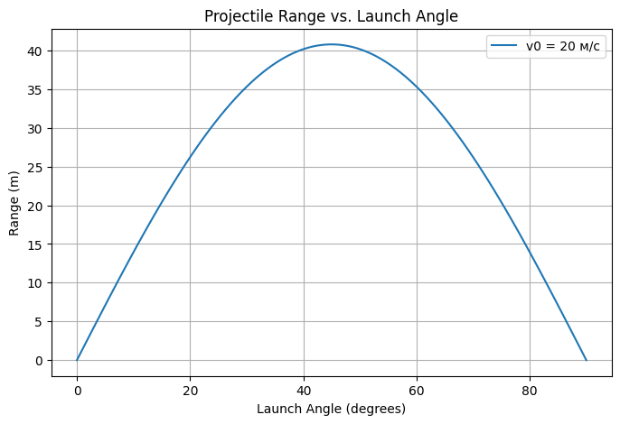

Конечно — вот твой текст с заменой всех ( на \$ и \[ на \$\$ без пробелов:

---

# Problem 1

# **Investigating Projectile Motion: Dependence of Range on Launch Angle**

Projectile motion, the movement of an object thrown at an angle to the horizontal, is a fundamental concept in physics. Understanding how the range of a projectile depends on the launch angle is not only mathematically intriguing but also has numerous real-world applications. This principle is widely used in various fields, from analyzing the flight of a soccer ball to calculating the trajectory of a spacecraft.

---

## **1. Theoretical Foundation**

I see you're asking about deriving the equations for projectile motion, specifically the range equation $R = \frac{v\_0^2 \sin(2\theta)}{g}$, as shown in the image. Let's go through the derivation step by step using the given equations of motion. We'll assume you're looking to derive the range \$R\$, since that's the final equation highlighted, but if you'd like to derive another part (like the time of flight), let me know!

### Step 1: Understand the Setup

Projectile motion describes an object launched at an initial velocity $v\_0$ at an angle $\theta$ to the horizontal, under the influence of gravity $g$ (with no air resistance). The motion can be broken into two independent components:

* **Horizontal motion** (x-direction): Constant velocity, since there's no horizontal acceleration.
* **Vertical motion** (y-direction): Accelerated motion due to gravity.

The given equations are:

* Horizontal position: $x = v\_0 \cos \theta \cdot t$
* Vertical position: $y = v\_0 \sin \theta \cdot t - \frac{1}{2} g t^2$
* Time of flight: $t=\frac{2 v\_0 \sin \theta}{g}$ (when $y = 0$, i.e., when the projectile returns to the ground)
* Range: $R = \frac{v\_0^2 \sin(2\theta)}{g}$

Our goal is to derive the range \$R\$.

---

### Step 2: Derive the Time of Flight

First, we need the total time the projectile is in the air (time of flight). The projectile returns to the ground when its vertical position \$y = 0\$.

Use the vertical position equation:

$$
y = v_0 \sin \theta \cdot t - \frac{1}{2} g t^2
$$

Set \$y = 0\$ (when the projectile lands):

$$
0 = v_0 \sin \theta \cdot t - \frac{1}{2} g t^2
$$

Factor out \$t\$:

$$
t \left( v_0 \sin \theta - \frac{1}{2} g t \right) = 0
$$

This gives two solutions:

* \$t = 0\$ (the launch point)
* \$v\_0 \sin \theta - \frac{1}{2} g t = 0\$

Solve the second equation:

$$
v_0 \sin \theta - \frac{1}{2} g t = 0
$$

$$
\frac{1}{2} g t = v_0 \sin \theta
$$

$$
t = \frac{v_0 \sin \theta}{\frac{1}{2} g} = \frac{2 v_0 \sin \theta}{g}
$$

This matches the given time of flight:

$$
t = \frac{2 v_0 \sin \theta}{g}
$$

This is the total time the projectile is in the air.

---

### Step 3: Derive the Range \$R\$

The range \$R\$ is the horizontal distance traveled when the projectile lands, i.e., the value of \$x\$ when \$t = \frac{2 v\_0 \sin \theta}{g}\$.

Use the horizontal position equation:

$$
x = v_0 \cos \theta \cdot t
$$

Substitute the time of flight \$t = \frac{2 v\_0 \sin \theta}{g}\$:

$$
R = x = v_0 \cos \theta \cdot \left( \frac{2 v_0 \sin \theta}{g} \right)
$$

Simplify:

$$
R = \frac{v_0 \cdot 2 v_0 \sin \theta \cos \theta}{g} = \frac{2 v_0^2 \sin \theta \cos \theta}{g}
$$

Now, use the trigonometric identity \$\sin(2\theta) = 2 \sin \theta \cos \theta\$:

$$
2 \sin \theta \cos \theta = \sin(2\theta)
$$

Substitute this into the equation:

$$
R = \frac{v_0^2 \sin(2\theta)}{g}
$$

This matches the given range equation:

$$
R = \frac{v_0^2 \sin(2\theta)}{g}
$$

---

### Step 4: Verify the Result

The derived equation shows that the range depends on:

* The square of the initial velocity (\$v\_0^2\$),
* The sine of twice the launch angle (\$\sin(2\theta)\$),
* The gravitational acceleration (\$g\$).

This makes physical sense:

* A higher initial velocity increases the range (since \$v\_0^2\$).
* The \$\sin(2\theta)\$ term indicates that the range is maximized when \$2\theta = 90^\circ\$, or \$\theta = 45^\circ\$, which is a well-known result in projectile motion.
* A larger \$g\$ (e.g., on a planet with stronger gravity) reduces the range.

---

### Final Answer

The range of the projectile is:

$$
R = \frac{v_0^2 \sin(2\theta)}{g}
$$

This was derived by:

1. Finding the time of flight by setting the vertical position to zero.
2. Substituting the time of flight into the horizontal position equation.
3. Simplifying using the trigonometric identity \$2 \sin \theta \cos \theta = \sin(2\theta)\$.

If you'd like to derive any other part of the projectile motion equations (e.g., maximum height) or need a numerical example, let me know!

---

## **2. Range Analysis Based on Launch Angle**

Key observations:

* **Maximum range** occurs at \$\theta = 45^\circ\$ (assuming no air resistance).
* **Symmetry of trajectory:** The same range is achieved at complementary angles (e.g., \$30^\circ\$ and \$60^\circ\$ result in the same range).
* **Dependence on velocity:** Since \$R\propto v\_0^2\$, doubling the initial velocity quadruples the range.
* **Effect of gravity:** On planets with lower gravity (e.g., the Moon, where \$g \approx 1.62\$ m/s²), projectiles travel much farther than on Earth.

---

## **3. Practical Applications of Projectile Motion**

Projectile motion plays a crucial role in various fields:

1. **Sports:** Optimizing kick angles in soccer, basketball shots, and long jumps.
2. **Ballistics:** Calculating bullet and missile trajectories.
3. **Engineering:** Designing structures resistant to impact forces.
4. **Space Exploration:** Determining launch trajectories for satellites and landers.

However, real-world factors complicate the idealized model:

* **Air resistance** reduces the range.
* **Uneven terrain** affects the landing position.
* **Magnus effect (object spin)** alters the trajectory (e.g., in soccer or tennis).

---

## **4. Implementation and Visualization with Code**

To gain a deeper understanding of projectile motion, Python can be used to compute and visualize the relationship between launch angle and range.

```python
import numpy as np
import matplotlib.pyplot as plt

def range_of_projectile(v0, theta, g=9.81):
    theta_rad = np.radians(theta)
    return (v0**2 * np.sin(2 * theta_rad)) / g

# Variable
v0 = 20  # м/с
angles = np.linspace(0, 90, 100) 
ranges = [range_of_projectile(v0, theta) for theta in angles]

# Graph
plt.figure(figsize=(8, 5))
plt.plot(angles, ranges, label=f'v0 = {v0} м/с')
plt.xlabel('Launch Angle (degrees)')
plt.ylabel('Range (m)')
plt.title('Projectile Range vs. Launch Angle')
plt.legend()
plt.grid()
plt.show()
```


### **What does the provided script do?**

✅ Computes the range for angles from \$0^\circ\$ to \$90^\circ\$.
✅ Simulates the effect of different initial velocities.
✅ Plots a graph of range vs. launch angle.

If additional factors such as air resistance or variable gravity (e.g., Mars) need to be considered, the code can be extended. Would you like to incorporate such enhancements? 🚀


