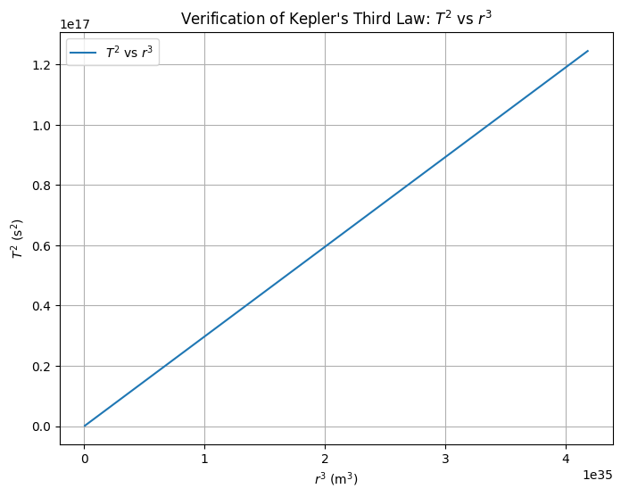

# Problem 1
**Step-by-Step Solution: Orbital Period and Orbital Radius (Kepler's Third Law)**

**Step 1: Derive the Relationship Between Orbital Period and Orbital Radius**
Kepler's Third Law states that the square of the orbital period of a planet is proportional to the cube of its average distance from the Sun (or the central body it orbits). Let's derive this relationship for circular orbits.

Consider a planet of mass $m$ orbiting a central body (e.g., the Sun) of mass $M$ in a circular orbit with radius $r$. The gravitational force provides the centripetal force required for circular motion.

- **Gravitational Force**: The force between the planet and the central body is given by Newton's law of gravitation:
$$
F = \frac{G M m}{r^2}
$$
where $G$ is the gravitational constant, $M$ is the mass of the central body, $m$ is the mass of the planet, and $r$ is the orbital radius.

- **Centripetal Force**: For circular motion, the centripetal force required to keep the planet in orbit is:
$$
F_c = \frac{m v^2}{r}
$$
where $v$ is the orbital velocity of the planet.

Since the gravitational force provides the centripetal force:
$$
\frac{G M m}{r^2} = \frac{m v^2}{r}
$$
The $m$ terms cancel out (assuming $m \neq 0$):
$$
\frac{G M}{r^2} = \frac{v^2}{r}
$$
Multiply both sides by $r$:
$$
\frac{G M}{r} = v^2
$$
$$
v = \sqrt{\frac{G M}{r}}
$$

- **Orbital Period**: The orbital period $T$ is the time it takes for the planet to complete one full orbit. The circumference of the circular orbit is $2\pi r$, and the planet travels at speed $v$, so:
$$
T = \frac{\text{circumference}}{\text{velocity}} = \frac{2 \pi r}{v}
$$
Substitute $v = \sqrt{\frac{G M}{r}}$:
$$
T = \frac{2 \pi r}{\sqrt{\frac{G M}{r}}} = 2 \pi r \sqrt{\frac{r}{G M}} = 2 \pi r^{3/2} \frac{1}{\sqrt{G M}}
$$
Simplify:
$$
T = 2 \pi \sqrt{\frac{r^3}{G M}}
$$
Square both sides to get Kepler's Third Law:
$$
T^2 = \left( 2 \pi \sqrt{\frac{r^3}{G M}} \right)^2 = 4 \pi^2 \frac{r^3}{G M}
$$
Rearrange:
$$
T^2 = \left( \frac{4 \pi^2}{G M} \right) r^3
$$
This shows that $T^2$ is proportional to $r^3$, with the constant of proportionality $\frac{4\pi^2}{G M}$, which depends on the mass of the central body $M$.

---

**Step 2: Discuss the Implications for Planetary Motions**
Kepler's Third Law has significant implications for understanding planetary motions:
- **Uniformity Across Planets**: For planets orbiting the same central body (e.g., the Sun), $G$ and $M$ are constant, so $T^2 \propto r^3$. This allows us to compare the orbits of different planets. For example, if one planet is at a distance twice that of another, its orbital period will be $2^{3/2} = \sqrt{8} \approx 2.828$ times longer.
- **Role of Masses**: The mass of the central body $M$ affects the orbital period, but the mass of the planet $m$ does not (as it cancels out). This is why all planets, regardless of their mass, follow the same $T^2 \propto r^3$ relationship when orbiting the same star.
- **Applications**: This law helps astronomers determine the mass of a central body by observing the periods and distances of orbiting objects (e.g., moons or planets). It also aids in predicting the orbital periods of artificial satellites.

---
**Step 3: Analyze Real-World Examples**
- **Moon's Orbit Around Earth**: The Moon orbits Earth at an average distance of approximately $r = 384,400\,\text{km}$ with a period of about $T = 27.32\,\text{days}$. Using Kepler's Third Law, we can estimate Earth's mass:
$$
T^2 = \left( \frac{4 \pi^2}{G M} \right) r^3
$$
Convert units: $r = 384,400\,\text{km} = 3.844 \times 10^8\,\text{m}$, $T = 27.32\,\text{days} = 27.32 \times 86,400\,\text{s} = 2.360 \times 10^6\,\text{s}$, $G = 6.674 \times 10^{-11}\,\text{m}^3 \text{kg}^{-1} \text{s}^{-2}$.
$$
(2.360 \times 10^6)^2 = \frac{4 \pi^2}{G M} (3.844 \times 10^8)^3
$$
Solve for $M$:
$$
M = \frac{4 \pi^2 (3.844 \times 10^8)^3}{G (2.360 \times 10^6)^2}
$$
Compute numerically: $M \approx 5.97 \times 10^{24}\,\text{kg}$, which matches Earth's mass.
- **Planets in the Solar System**: For Earth, $r = 1\,\text{AU} \approx 1.496 \times 10^{11}\,\text{m}$, $T = 1\,\text{year} \approx 3.156 \times 10^7\,\text{s}$. Using the Sun's mass $M \approx 1.989 \times 10^{30}\,\text{kg}$, we can verify Kepler's Third Law and extend it to other planets like Jupiter ($r \approx 5.2\,\text{AU}$).

---
**Step 4: Implement a Computational Model**
Below is a Python script to simulate circular orbits and verify Kepler's Third Law by plotting $T^2$ versus $r^3$ for different orbital radii.

---
**Python Code: Orbital Period Simulation**

``` py

import numpy as np
import matplotlib.pyplot as plt

# Constants
G = 6.674e-11  # Gravitational constant (m^3 kg^-1 s^-2)
M = 1.989e30   # Mass of the Sun (kg)

# Function to calculate orbital period T given radius r
def orbital_period(r, G, M):
    return 2 * np.pi * np.sqrt(r**3 / (G * M))

# Range of orbital radii (in meters, from 0.5 AU to 5 AU)
r = np.linspace(0.5 * 1.496e11, 5 * 1.496e11, 100)

# Calculate T for each r
T = orbital_period(r, G, M)

# Calculate T^2 and r^3 for plotting
T_squared = T**2
r_cubed = r**3

# Plot T^2 vs r^3
plt.figure(figsize=(8, 6))
plt.plot(r_cubed, T_squared, label='$T^2$ vs $r^3$')
plt.xlabel('$r^3$ (m$^3$)')
plt.ylabel('$T^2$ (s$^2$)')
plt.title('Verification of Kepler\'s Third Law: $T^2$ vs $r^3$')
plt.grid(True)
plt.legend()
plt.show()

# Print a few example values
print("Example Orbital Periods:")
for i in range(0, 100, 20):
    r_au = r[i] / 1.496e11  # Convert to AU
    T_years = T[i] / (3.156e7)  # Convert to years
    print(f"r = {r_au:.2f} AU, T = {T_years:.2f} years")

```

---
**Explanation of the Code**
- **Constants**: We define $G$ and $M$ (mass of the Sun) to compute the orbital period.
- **Function**: The `orbital_period` function implements the formula $T = 2\pi \sqrt{\frac{r^3}{G M}}$.
- **Simulation**: We calculate $T$ for a range of $r$ values (from 0.5 AU to 5 AU), then plot $T^2$ versus $r^3$ to verify the linear relationship predicted by Kepler's Third Law.
- **Output**: The plot should show a straight line, confirming $T^2 \propto r^3$. We also print example values of $r$ (in AU) and $T$ (in years) for reference.

---
**Discussion: Extension to Elliptical Orbits and Other Celestial Bodies**
- **Elliptical Orbits**: Kepler's Third Law in its general form applies to elliptical orbits, where $r$ is replaced by the semi-major axis $a$ of the ellipse: $T^2 = \left( \frac{4 \pi^2}{G M} \right) a^3$. This extends the law to all bound orbits, not just circular ones.
- **Other Systems**: The law applies to any system where one body orbits another under gravitational attraction, such as moons around planets, binary stars, or exoplanets around their stars. For example, the moons of Jupiter (e.g., Io, Europa) follow the same relationship with Jupiter's mass.
- **Limitations**: The derivation assumes the mass of the orbiting body is much smaller than the central body ($m \ll M$). For systems like binary stars, a more general form of Kepler's Third Law is needed, accounting for the masses of both bodies.