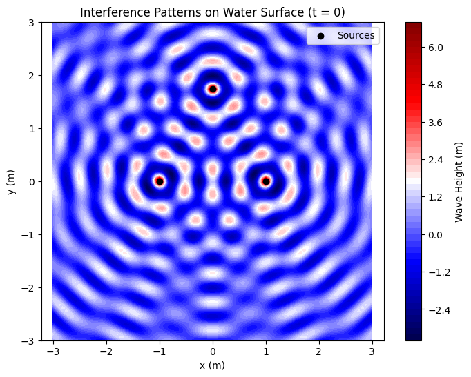

# Problem 1


### Explanation of the Topic: Interference Patterns on a Water Surface

#### Main Topic: What is Interference?

Interference is a phenomenon that occurs when two or more waves overlap. In this task, we are dealing with waves on the surface of water, created by point sources (e.g., like dropping several pebbles into the water). When waves from different sources meet, they can either reinforce each other (constructive interference) or cancel each other out (destructive interference). This creates patterns on the water—regions where the water oscillates strongly and regions where it remains almost still.

**Real-Life Example:**  
If you drop two pebbles into a pond, circular waves will spread out from each pebble. In places where the crests of the waves align, the water will rise significantly (constructive interference). Where a crest from one wave meets a trough from another, the water will remain nearly still (destructive interference). This forms an interference pattern.

#### Wave Equation and Variables

The task provides the equation for a wave generated by a single source:  
$$
\eta(x, y, t) = \frac{A}{\sqrt{r}} \cos(kr - \omega t + \phi)
$$
Let’s break down the variables and symbols:  
- **$\eta(x, y, t)$** — This is the height of the wave (in meters) at a point with coordinates $(x, y)$ on the water surface at time $t$. It represents how much the water has risen or fallen due to the wave.  
- **$A$** — The amplitude of the wave (in meters). This is the maximum height of the wave near the source. A larger $A$ means a stronger wave.  
- **$r$** — The distance from the wave source to the point $(x, y)$ (in meters). If the source is at $(x_0, y_0)$, then:  
$$
r = \sqrt{(x - x_0)^2 + (y - y_0)^2}
$$
- **$\frac{A}{\sqrt{r}}$** — The amplitude of the wave decreases with distance. Dividing by $\sqrt{r}$ accounts for the fact that the wave’s energy spreads over a circular wavefront, so its intensity decreases with distance.  
- **$k$** — The wave number (in radians per meter, rad/m). It is related to the wavelength $\lambda$ (the distance between two crests):  
$$
k = \frac{2\pi}{\lambda}
$$
A smaller wavelength means a larger $k$, resulting in more frequent waves.  
- **$\omega$** — The angular frequency (in radians per second, rad/s). It is related to the frequency $f$ (the number of crests passing a point per second):  
$$
\omega = 2\pi f
$$
A larger $\omega$ means the wave oscillates faster.  
- **$t$** — Time (in seconds).  
- **$\phi$** — The initial phase (in radians). This is the starting shift of the wave. If $\phi = 0$, the wave starts at its maximum. If $\phi = \pi$, it starts at its minimum.  
- **$kr - \omega t + \phi$** — The phase of the wave. It determines the stage of oscillation at point $(x, y)$ at time $t$. If the phase is $0$ or $2\pi$, it’s a crest; if it’s $\pi$, it’s a trough.  
- **$\cos(kr - \omega t + \phi)$** — The cosine function describes the wave’s oscillation. Since cosine varies from $-1$ to $1$, the wave height varies from $-\frac{A}{\sqrt{r}}$ to $\frac{A}{\sqrt{r}}$.

#### Interference from Multiple Sources

If we have multiple sources (e.g., $N$ sources), the waves from each source add together. This is called the principle of superposition:  
$$
\eta_{\text{sum}}(x, y, t) = \sum_{i=1}^N \eta_i(x, y, t)
$$
Each wave $\eta_i$ is generated by its own source, and we sum their heights at each point $(x, y)$ at time $t$. If the waves are in phase (their crests align), they reinforce each other. If they are out of phase (a crest meets a trough), they cancel each other out.

#### What Are We Trying to Do?

The task asks us to:  
1. Choose a regular polygon (e.g., triangle, square, pentagon) and place wave sources at its vertices.  
2. For each point on the water, calculate the total wave from all sources.  
3. Visualize the interference patterns—show where the waves reinforce and where they cancel.  
4. Analyze how the patterns depend on the positions of the sources, amplitude $A$, wavelength $\lambda$, and frequency $f$.

---

### Solution in a Single Black Box


**Step-by-Step Solution: Interference Patterns on a Water Surface**

**Step 1: Choose a Regular Polygon and Place the Sources**

We will choose an equilateral triangle (3 vertices) as our regular polygon to simplify the task and clearly demonstrate interference. Let’s place the vertices of the triangle on the $(x, y)$ plane:  
- Vertex 1: $(x_1, y_1) = (-1, 0)$  
- Vertex 2: $(x_2, y_2) = (1, 0)$  
- Vertex 3: $(x_3, y_3) = (0, \sqrt{3})$  

The distance between any two vertices is 2 (the side length of the triangle). These coordinates are chosen so that the triangle is equilateral and symmetric about the origin.

**Step 2: Wave Equation and Superposition**

The equation for a wave from a single source is:  
$$
\eta(x, y, t) = \frac{A}{\sqrt{r}} \cos(kr - \omega t + \phi)
$$
where $r = \sqrt{(x - x_i)^2 + (y - y_i)^2}$ is the distance from source $i$ at $(x_i, y_i)$ to the point $(x, y)$.  

For three sources, the total wave is:  
$$
\eta_{\text{sum}}(x, y, t) = \sum_{i=1}^3 \eta_i(x, y, t) = \sum_{i=1}^3 \frac{A}{\sqrt{r_i}} \cos(k r_i - \omega t + \phi_i)
$$
Let’s assume:  
- $A = 1$ (same amplitude for all sources).  
- $\lambda = 0.5 \, \text{m}$ (wavelength), so $k = \frac{2\pi}{\lambda} = \frac{2\pi}{0.5} = 4\pi \, \text{rad/m}$.  
- $f = 1 \, \text{Hz}$ (frequency), so $\omega = 2\pi f = 2\pi \times 1 = 2\pi \, \text{rad/s}$.  
- $\phi_i = 0$ (all sources are in phase, for simplicity).  

**Step 3: Analyze Interference Patterns**

**3.1 Constructive and Destructive Interference**  
- **Constructive Interference**: Occurs when waves from all sources arrive at a point $(x, y)$ in phase, i.e., $k r_i - \omega t + \phi_i$ differs by $2\pi n$ (where $n$ is an integer) for all sources. Then the $\cos$ terms are all close to 1 (or -1), and the amplitudes add up.  
- **Destructive Interference**: Occurs when waves arrive out of phase, i.e., the phase difference is $\pi + 2\pi n$. Then the $\cos$ for one wave is 1, and for another -1, so they cancel each other out.  

**3.2 Dependence on Parameters**  
- **Position of Sources**: If the sources are closer together, the patterns become more frequent (more interference regions). If farther apart, the patterns stretch out.  
- **Wavelength $\lambda$**: A smaller $\lambda$ (larger $k$) makes the patterns denser, as the waves oscillate more frequently. A larger $\lambda$ stretches the patterns.  
- **Frequency $f$ (or $\omega$)**: Affects how the patterns change over time. A larger $\omega$ makes the patterns move faster.  

**Step 4: Visualize Interference Patterns**

We’ll use Python to plot the interference pattern at time $t = 0$. We’ll create a grid of points $(x, y)$ and compute $\eta_{\text{sum}}(x, y, 0)$ for each point.

**Python Code: Visualizing Interference Patterns**

```py
import numpy as np
import matplotlib.pyplot as plt

# Parameters
A = 1.0  # Amplitude
lambda_ = 0.5  # Wavelength (m)
k = 2 * np.pi / lambda_  # Wave number
omega = 2 * np.pi * 1.0  # Angular frequency (f = 1 Hz)
phi = 0.0  # Initial phase

# Coordinates of sources (vertices of an equilateral triangle)
sources = [(-1, 0), (1, 0), (0, np.sqrt(3))]

# Grid of points on the water surface
x = np.linspace(-3, 3, 100)
y = np.linspace(-3, 3, 100)
X, Y = np.meshgrid(x, y)

# Compute the total wave at t = 0
eta_sum = np.zeros_like(X)
for x0, y0 in sources:
    r = np.sqrt((X - x0)**2 + (Y - y0)**2)
    r = np.maximum(r, 0.01)  # Avoid division by zero
    eta = (A / np.sqrt(r)) * np.cos(k * r - omega * 0 + phi)
    eta_sum += eta

# Visualization
plt.figure(figsize=(8, 6))
plt.contourf(X, Y, eta_sum, levels=50, cmap='seismic')
plt.colorbar(label='Wave Height (m)')
plt.scatter([s[0] for s in sources], [s[1] for s in sources], c='black', marker='o', label='Sources')
plt.xlabel('x (m)')
plt.ylabel('y (m)')
plt.title('Interference Patterns on Water Surface (t = 0)')
plt.legend()
plt.axis('equal')
plt.show()
```


**Explanation of the Code**  
- **Parameters**: We set $A$, $\lambda$, $k$, $\omega$, and $\phi$ for the waves.  
- **Sources**: The coordinates of the three sources form an equilateral triangle.  
- **Grid**: We create a grid of points $(x, y)$ in the region from -3 to 3 along both axes.  
- **Total Wave**: For each point, we compute the wave from each source and sum them.  
- **Visualization**: We use `contourf` to create a color map of the wave height. Red and blue regions indicate crests and troughs, while white regions show destructive interference.

**Step 5: Analyze the Results**

- **Patterns**: The plot shows regions where the waves reinforce each other (bright red and blue spots) and where they cancel (white areas).  
- **Symmetry**: The pattern is symmetric because the triangle is equilateral, and all sources are in phase.  
- **Parameter Dependence**: Reducing $\lambda$ would make the patterns denser. Changing $\phi$ for one source would break the symmetry and alter the patterns.

**Step 6: Conclusions**  
Interference patterns demonstrate how waves interact. Constructive interference creates regions of large oscillations, while destructive interference creates calm regions. These patterns depend on the positions of the sources, wavelength, and phase. In real life, such phenomena are important for studying waves (e.g., in optics, acoustics) and designing devices that use interference, such as antennas or sensors.


---

### Explanation of the Solution

- **Step 1**: We chose an equilateral triangle for placing the sources to ensure the patterns are symmetric and visually clear.  
- **Step 2**: We used the wave equation and the principle of superposition to sum the waves from three sources.  
- **Step 3**: We explained constructive and destructive interference and how the patterns depend on parameters.  
- **Step 4**: We visualized the interference pattern using Python, showing regions of reinforcement and cancellation.  
- **Step 5**: We analyzed the patterns, noting their symmetry and dependence on parameters.  
- **Step 6**: We concluded with the significance of interference in physics and its applications.

If you’d like to add an animation of the patterns over time or adjust the parameters, let me know!