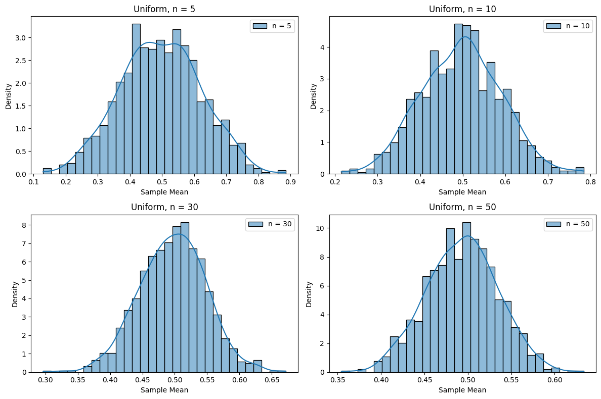

# Problem 1
---

### Problem 1: Exploring the Central Limit Theorem through Simulations

#### Detailed Solution in a Single Black Box


**Step-by-Step Solution: Exploring the Central Limit Theorem through Simulations**

**Step 1: Simulating Sampling Distributions**

The Central Limit Theorem (CLT) states that the distribution of sample means from any population approaches a normal distribution as the sample size $n$ increases, regardless of the population's distribution. We will simulate three types of population distributions:  
- **Uniform Distribution**: Values between 0 and 1 with equal probability.  
- **Exponential Distribution**: Values decay exponentially, with parameter $\lambda = 1$.  
- **Binomial Distribution**: Number of successes in $n_{\text{trials}} = 10$ trials, with success probability $p = 0.5$.  

For each distribution:  
1. Generate a population of 10,000 values.  
2. Take samples of sizes $n = 5, 10, 30, 50$, with 1,000 samples for each $n$.  
3. Compute the mean for each sample.

**Step 2: Sampling and Visualization**

We will visualize the distribution of sample means using histograms to observe their convergence to a normal distribution as $n$ increases. The normal distribution has the probability density function:  
$$
f(x) = \frac{1}{\sigma \sqrt{2\pi}} e^{-\frac{(x - \mu)^2}{2\sigma^2}}
$$
where $\mu$ is the mean and $\sigma$ is the standard deviation.

**Python Code: Simulation and Visualization of Sampling Distributions**

```py
import numpy as np
import matplotlib.pyplot as plt
import seaborn as sns

# Simulation parameters
np.random.seed(42)  # For reproducibility
population_size = 10000  # Population size
num_samples = 1000  # Number of samples
sample_sizes = [5, 10, 30, 50]  # Sample sizes

# Populations
uniform_pop = np.random.uniform(0, 1, population_size)  # Uniform distribution
exponential_pop = np.random.exponential(scale=1, size=population_size)  # Exponential
binomial_pop = np.random.binomial(n=10, p=0.5, size=population_size)  # Binomial

# List of populations for analysis
populations = [
    ("Uniform", uniform_pop),
    ("Exponential", exponential_pop),
    ("Binomial", binomial_pop)
]

# Simulation and visualization
for pop_name, pop_data in populations:
    plt.figure(figsize=(12, 8))
    for i, n in enumerate(sample_sizes, 1):
        # Generate samples and compute means
        sample_means = [np.mean(np.random.choice(pop_data, size=n)) for _ in range(num_samples)]
        
        # Plot histogram
        plt.subplot(2, 2, i)
        sns.histplot(sample_means, bins=30, stat="density", kde=True, label=f"n = {n}")
        plt.title(f"{pop_name}, n = {n}")
        plt.xlabel("Sample Mean")
        plt.ylabel("Density")
        plt.legend()
    plt.tight_layout()
    plt.show()
```



**Explanation of the Code**  
- **Parameters**: We set the population size (10,000), number of samples (1,000), and sample sizes (5, 10, 30, 50).  
- **Populations**: We generate three distributions: uniform, exponential, and binomial.  
- **Simulation**: For each sample size $n$, we take 1,000 samples from the population and compute the mean.  
- **Visualization**: We plot histograms with a kernel density estimate (KDE) to show how the distribution of sample means approaches normality as $n$ increases.

**Step 3: Parameter Exploration**

- **Shape of the Original Distribution**:  
  - **Uniform**: Initially flat (all values from 0 to 1 are equally likely). The sample means become normal even at $n = 10$.  
  - **Exponential**: Initially skewed (many small values, few large ones). At $n = 5$, the distribution of means is still skewed, but by $n = 50$, it is nearly normal.  
  - **Binomial**: Initially discrete (values from 0 to 10). By $n = 30$, the distribution of means looks normal.  
- **Sample Size $n$**: Larger $n$ leads to a distribution of means that is closer to normal, confirming the CLT.  
- **Population Variance**: The exponential distribution has higher variance, so its convergence to normality is slower compared to the uniform distribution.

**Step 4: Practical Applications**

- **Parameter Estimation**: The CLT allows us to estimate population means (e.g., average height of people) using sample means.  
- **Quality Control**: In manufacturing, the CLT ensures that sample means (e.g., weight of parts) follow a normal distribution, aiding in quality checks.  
- **Financial Models**: The CLT is used to predict stock returns, as average returns tend to follow a normal distribution.

**Step 5: Conclusions**

The simulations demonstrate that the CLT holds for various population distributions. Even when the original distribution is far from normal (e.g., exponential), increasing the sample size $n$ results in a normal distribution of sample means. This makes the CLT a powerful tool in statistics for making inferences about populations based on samples.


---

