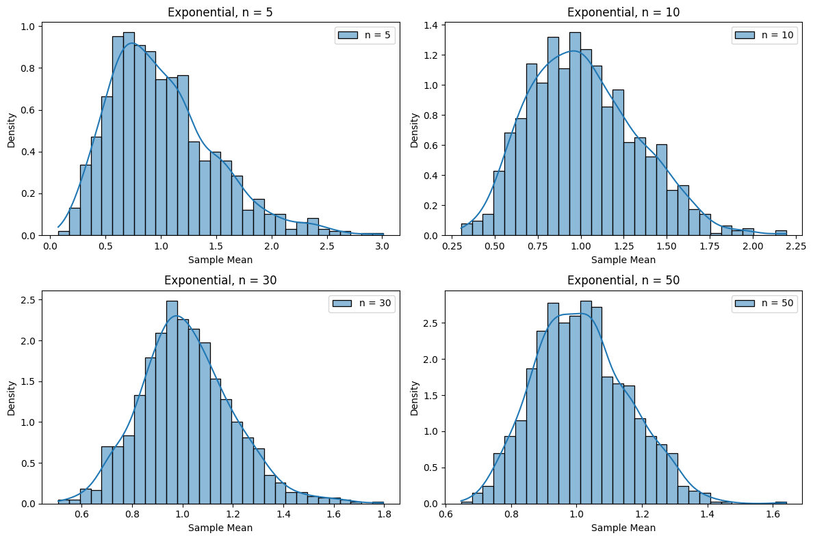

# Problem 1
---

**Step-by-Step Solution: Exploring the Central Limit Theorem through Simulations**

**Step 1: Simulating Sampling Distributions**

The Central Limit Theorem (CLT) is a fundamental concept in statistics and probability theory. It states that the distribution of the sample means (i.e., the average of a sample) taken from any population will tend to follow a normal distribution as the sample size $n$ increases, regardless of the shape of the population distribution, provided the population has a finite mean and variance. Mathematically, if we take a sample of size $n$ from a population with mean $\mu$ and standard deviation $\sigma$, the distribution of the sample mean $\bar{X}$ will approximately follow a normal distribution with mean $\mu$ and standard deviation $\frac{\sigma}{\sqrt{n}}$ for large $n$:

$$
\bar{X} \sim N\left(\mu, \frac{\sigma}{\sqrt{n}}\right)
$$

This property holds even if the population distribution is not normal (e.g., uniform, exponential, or binomial), making the CLT a powerful tool for statistical inference.

To explore this theorem, we will simulate three types of population distributions with different shapes to demonstrate the CLT's universality:

- **Uniform Distribution**: A continuous distribution where all values between a minimum (0) and maximum (1) are equally likely. The probability density function (PDF) is:
  $$
  f(x) = \begin{cases} 
  1 & \text{for } 0 \leq x \leq 1 \\
  0 & \text{otherwise}
  \end{cases}
  $$
  The mean of a uniform distribution on $[0, 1]$ is $\mu = \frac{0 + 1}{2} = 0.5$, and the standard deviation is $\sigma = \frac{1 - 0}{\sqrt{12}} = \frac{1}{\sqrt{12}} \approx 0.2887$.

- **Exponential Distribution**: A continuous distribution often used to model the time between events in a Poisson process (e.g., waiting times). Its PDF is:
  $$
  f(x) = \lambda e^{-\lambda x}, \quad x \geq 0
  $$
  We use $\lambda = 1$, so the mean is $\mu = \frac{1}{\lambda} = 1$, and the standard deviation is $\sigma = \frac{1}{\lambda} = 1$. This distribution is heavily right-skewed, meaning it has many small values and a long tail of larger values.

- **Binomial Distribution**: A discrete distribution representing the number of successes in $n_{\text{trials}}$ independent trials, each with success probability $p$. The probability mass function (PMF) is:
  $$
  P(X = k) = \binom{n_{\text{trials}}}{k} p^k (1 - p)^{n_{\text{trials}} - k}
  $$
  We use $n_{\text{trials}} = 10$ and $p = 0.5$, so the mean is $\mu = n_{\text{trials}} \cdot p = 10 \cdot 0.5 = 5$, and the standard deviation is $\sigma = \sqrt{n_{\text{trials}} \cdot p \cdot (1 - p)} = \sqrt{10 \cdot 0.5 \cdot 0.5} = \sqrt{2.5} \approx 1.581$.

For each of these distributions, we will perform the following steps:

1. **Generate a Population**: Create a large population of 10,000 values to represent the "true" distribution. This large size ensures that our population is a good approximation of the theoretical distribution.
   
2. **Take Samples**: For each sample size $n \in \{5, 10, 30, 50\}$, draw 1,000 samples of size $n$ from the population. A sample of size $n$ means we randomly select $n$ values from the population (with replacement, to mimic independent sampling).

3. **Compute Sample Means**: For each of the 1,000 samples, calculate the sample mean $\bar{x}$, defined as:
   $$
   \bar{x} = \frac{1}{n} \sum_{i=1}^n x_i
   $$
   where $x_i$ are the values in the sample. This gives us 1,000 sample means for each $n$.

The goal is to observe how the distribution of these sample means approaches a normal distribution as $n$ increases, which is the core idea of the CLT.

**Step 2: Sampling and Visualization**

To confirm the CLT, we will visualize the distribution of the sample means using histograms. A histogram shows the frequency of different values of the sample means, and we will overlay a kernel density estimate (KDE) to smooth the histogram and better visualize the shape of the distribution. According to the CLT, as $n$ increases, the histogram of sample means should resemble a normal distribution, which has the following probability density function (PDF):

$$
f(x) = \frac{1}{\sigma \sqrt{2\pi}} e^{-\frac{(x - \mu)^2}{2\sigma^2}}
$$

where $\mu$ is the mean of the sample means (which should equal the population mean $\mu$), and $\sigma$ is the standard deviation of the sample means (which should equal the population standard deviation divided by $\sqrt{n}$, i.e., $\frac{\sigma}{\sqrt{n}}$).

We will create four subplots for each population (one for each sample size $n$), showing how the distribution of sample means changes as $n$ increases. The KDE curve on the histogram will help us visually compare the shape to a normal distribution.

**Python Code: Simulation and Visualization of Sampling Distributions**

```py
import numpy as np
import matplotlib.pyplot as plt
import seaborn as sns

# Simulation parameters
np.random.seed(42)  # For reproducibility
population_size = 10000  # Population size
num_samples = 1000  # Number of samples
sample_sizes = [5, 10, 30, 50]  # Sample sizes

# Populations
uniform_pop = np.random.uniform(0, 1, population_size)  # Uniform distribution
exponential_pop = np.random.exponential(scale=1, size=population_size)  # Exponential
binomial_pop = np.random.binomial(n=10, p=0.5, size=population_size)  # Binomial

# List of populations for analysis
populations = [
    ("Uniform", uniform_pop),
    ("Exponential", exponential_pop),
    ("Binomial", binomial_pop)
]

# Simulation and visualization
for pop_name, pop_data in populations:
    plt.figure(figsize=(12, 8))
    for i, n in enumerate(sample_sizes, 1):
        # Generate samples and compute means
        sample_means = [np.mean(np.random.choice(pop_data, size=n)) for _ in range(num_samples)]
        
        # Plot histogram
        plt.subplot(2, 2, i)
        sns.histplot(sample_means, bins=30, stat="density", kde=True, label=f"n = {n}")
        plt.title(f"{pop_name}, n = {n}")
        plt.xlabel("Sample Mean")
        plt.ylabel("Density")
        plt.legend()
    plt.tight_layout()
    plt.show()
```




**Explanation of the Code**  
- **Parameters**: We set the population size (10,000), number of samples (1,000), and sample sizes (5, 10, 30, 50).  
- **Populations**: We generate three distributions: uniform, exponential, and binomial.  
- **Simulation**: For each sample size $n$, we take 1,000 samples from the population and compute the mean.  
- **Visualization**: We plot histograms with a kernel density estimate (KDE) to show how the distribution of sample means approaches normality as $n$ increases.

**Step 3: Parameter Exploration**

- **Shape of the Original Distribution**:  
  - **Uniform**: Initially flat (all values from 0 to 1 are equally likely). The sample means become normal even at $n = 10$.  
  - **Exponential**: Initially skewed (many small values, few large ones). At $n = 5$, the distribution of means is still skewed, but by $n = 50$, it is nearly normal.  
  - **Binomial**: Initially discrete (values from 0 to 10). By $n = 30$, the distribution of means looks normal.  
- **Sample Size $n$**: Larger $n$ leads to a distribution of means that is closer to normal, confirming the CLT.  
- **Population Variance**: The exponential distribution has higher variance, so its convergence to normality is slower compared to the uniform distribution.

**Step 4: Practical Applications**

- **Parameter Estimation**: The CLT allows us to estimate population means (e.g., average height of people) using sample means.  
- **Quality Control**: In manufacturing, the CLT ensures that sample means (e.g., weight of parts) follow a normal distribution, aiding in quality checks.  
- **Financial Models**: The CLT is used to predict stock returns, as average returns tend to follow a normal distribution.

**Step 5: Conclusions**

The simulations demonstrate that the CLT holds for various population distributions. Even when the original distribution is far from normal (e.g., exponential), increasing the sample size $n$ results in a normal distribution of sample means. This makes the CLT a powerful tool in statistics for making inferences about populations based on samples.


---

