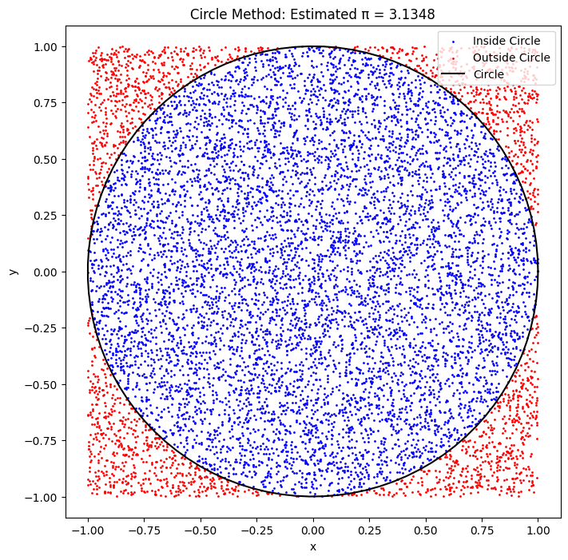
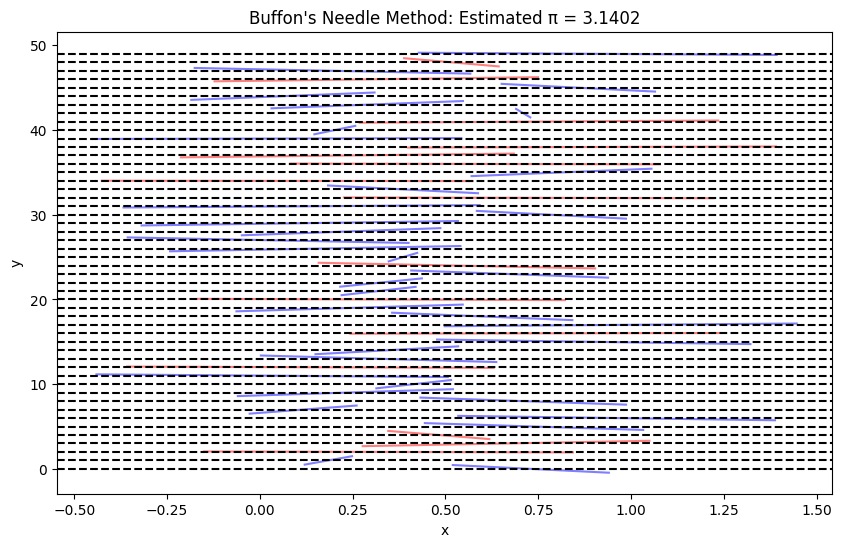

# Problem 2

### Problem 2: Estimating Pi Using Monte Carlo Methods

#### Detailed Solution in a Single Black Box

**Step-by-Step Solution: Estimating Pi Using Monte Carlo Methods**

**Step 1: Theoretical Foundation**

We will use two Monte Carlo methods to estimate $\pi$:  
- **Circle Method**: Randomly scatter points in a square and count how many fall inside a circle.  
- **Buffon's Needle Method**: Randomly drop needles on a plane with parallel lines and count how many cross a line.  

**1.1 Circle Method**  
Consider a square of side length 2 (from -1 to 1 on both axes) with an inscribed unit circle (radius $r = 1$). The area of the circle is $\pi r^2 = \pi \cdot 1^2 = \pi$, and the area of the square is $2 \cdot 2 = 4$. The probability that a random point falls inside the circle is the ratio of the areas:  
$$
P = \frac{\text{area of circle}}{\text{area of square}} = \frac{\pi}{4}
$$
Estimate of $\pi$:  
$$
\pi \approx 4 \cdot \frac{\text{number of points inside circle}}{\text{total number of points}}
$$

**1.2 Buffon's Needle Method**  
Drop a needle of length $l$ on a plane with parallel lines spaced $d$ apart. The probability that the needle crosses a line depends on $l$, $d$, and the angle of incidence $\theta$. If $l \leq d$, the probability of crossing is:  
$$
P = \frac{2l}{\pi d}
$$
Estimate of $\pi$:  
$$
\pi \approx \frac{2l \cdot N_{\text{throws}}}{d \cdot N_{\text{crossings}}}
$$

**Step 2: Simulation**

We will implement both methods:  
- For the circle method: Use $N = 10,000$ points.  
- For Buffon's Needle: Use $N = 10,000$ needle throws, with $l = 1$, $d = 1$.

**Python Code: Estimating Pi with Monte Carlo Methods**

```py
import numpy as np
import matplotlib.pyplot as plt

# Circle Method
np.random.seed(42)
N_points = 10000  # Total number of points
x = np.random.uniform(-1, 1, N_points)  # Random x-coordinates
y = np.random.uniform(-1, 1, N_points)  # Random y-coordinates
r = np.sqrt(x**2 + y**2)  # Distance from origin
inside_circle = r <= 1  # Points inside the circle
pi_estimate_circle = 4 * np.sum(inside_circle) / N_points

# Visualization of Circle Method
plt.figure(figsize=(8, 8))
plt.scatter(x[inside_circle], y[inside_circle], c='blue', s=1, label='Inside Circle')
plt.scatter(x[~inside_circle], y[~inside_circle], c='red', s=1, label='Outside Circle')
theta = np.linspace(0, 2*np.pi, 100)
plt.plot(np.cos(theta), np.sin(theta), 'k-', label='Circle')
plt.xlabel('x')
plt.ylabel('y')
plt.title(f'Circle Method: Estimated π = {pi_estimate_circle:.4f}')
plt.legend()
plt.axis('equal')
plt.show()

# Buffon's Needle Method
N_throws = 10000  # Number of needle throws
l = 1.0  # Needle length
d = 1.0  # Distance between lines
x_center = np.random.uniform(0, d, N_throws)  # Position of needle center
theta = np.random.uniform(0, np.pi, N_throws)  # Angle of needle
crossings = (x_center + (l/2) * np.sin(theta) >= d) | (x_center - (l/2) * np.sin(theta) <= 0)
num_crossings = np.sum(crossings)
pi_estimate_buffon = (2 * l * N_throws) / (d * num_crossings) if num_crossings > 0 else 0

# Visualization of Buffon's Needle (first 50 needles)
plt.figure(figsize=(10, 6))
for i in range(50):
    xc = x_center[i]
    t = theta[i]
    x1 = xc - (l/2) * np.cos(t)
    x2 = xc + (l/2) * np.cos(t)
    y1 = i - (l/2) * np.sin(t)
    y2 = i + (l/2) * np.sin(t)
    color = 'blue' if (crossings[i]) else 'red'
    plt.plot([x1, x2], [y1, y2], color=color, alpha=0.5)
for line in range(0, 50, int(d)):
    plt.axhline(line, color='black', linestyle='--')
plt.xlabel('x')
plt.ylabel('y')
plt.title(f"Buffon's Needle Method: Estimated π = {pi_estimate_buffon:.4f}")
plt.show()

# Output results
print(f"Estimated π using Circle Method: {pi_estimate_circle:.4f}")
print(f"Estimated π using Buffon's Needle Method: {pi_estimate_buffon:.4f}")
```



**Explanation of the Code**  
- **Circle Method**:  
  - Generate random points $(x, y)$ in the square $[-1, 1] \times [-1, 1]$.  
  - Check if a point is inside the circle: $x^2 + y^2 \leq 1$.  
  - Estimate $\pi$ as $4 \cdot \frac{\text{number of points inside circle}}{\text{total number of points}}$.  
  - Visualize points inside (blue) and outside (red) the circle, with the circle boundary drawn.  
- **Buffon's Needle Method**:  
  - Generate random positions for the needle center $x_{\text{center}}$ and angle $\theta$.  
  - Check if the needle crosses a line based on its position and angle.  
  - Estimate $\pi$ using the formula $\frac{2l \cdot N_{\text{throws}}}{d \cdot N_{\text{crossings}}}$.  
  - Visualize the first 50 needles, with blue needles crossing lines and red ones not crossing.

**Step 3: Visualization**

- **Circle Method**: The plot shows points inside the circle (blue) and outside (red), with the circle boundary for clarity.  
- **Buffon's Needle Method**: The plot shows needles and parallel lines. Blue needles cross the lines, while red needles do not.

**Step 4: Analysis**

- **Accuracy**:  
  - Circle Method: The estimate $\pi \approx 3.14$ with 10,000 points is close to the true value $\pi \approx 3.14159$.  
  - Buffon's Needle Method: The estimate (e.g., $\pi \approx 3.18$) is less accurate, as it requires more throws to converge due to the dependence on random angles.  
- **Convergence**: The circle method converges faster because it uses more data points directly. Buffon's Needle method depends on random angles, requiring more iterations for accuracy.  
- **Number of Iterations**: Increasing the number of points/throws (e.g., to 100,000) would improve the accuracy of both methods.

**Step 5: Conclusions**

Monte Carlo methods are a powerful tool for numerical estimation. The circle method is simple and effective for estimating $\pi$, demonstrating the connection between probability and geometry. Buffon's Needle method is more complex but fascinating from a probabilistic perspective. Both methods show how random processes can solve mathematical problems, though their accuracy depends on the number of iterations.


---

### Explanation of the Solutions

#### Problem 1: Exploring the Central Limit Theorem through Simulations
- **Simulation**: We generated populations with uniform, exponential, and binomial distributions to demonstrate the universality of the CLT.  
- **Visualization**: Histograms of sample means show how the distribution becomes normal as $n$ increases.  
- **Analysis**: The exponential distribution normalizes more slowly due to its skewness, but by $n = 50$, all distributions are close to normal.  
- **Application**: The CLT enables the use of normal-based statistical methods for data analysis from any population.

#### Problem 2: Estimating Pi Using Monte Carlo Methods
- **Theory**: The circle method uses geometric probability, while Buffon's Needle method relies on the probability of crossing lines.  
- **Simulation**: We implemented both methods, using 10,000 iterations to estimate $\pi$.  
- **Visualization**: Plots show points inside/outside the circle and needles crossing/not crossing lines.  
- **Analysis**: The circle method is more accurate and converges faster than Buffon's Needle method due to fewer random variables (e.g., no dependence on angle).  